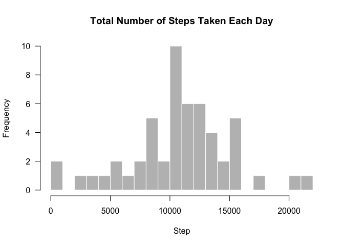
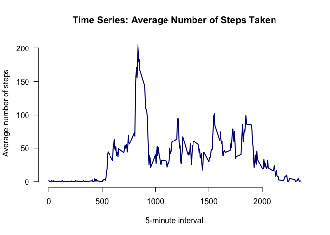
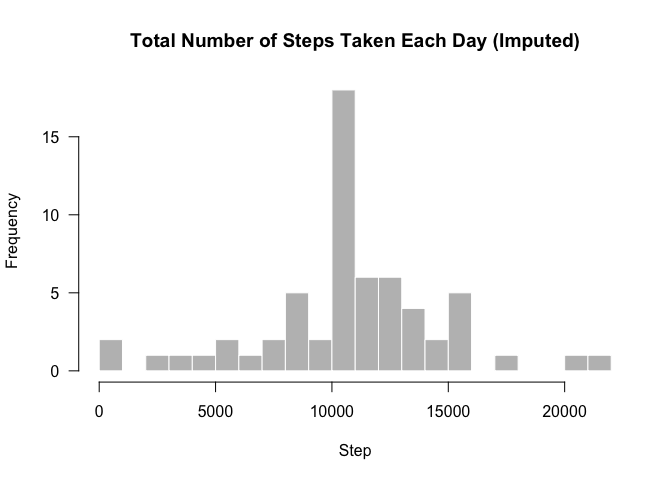
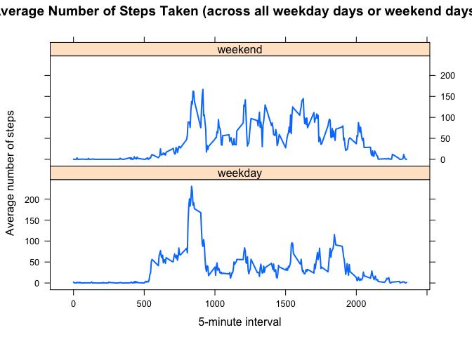

# Reproducible Research: Peer Assessment 1
Tianyuan Liu  
March 21, 2016  

##Loading and preprocessing the data

Show any code that is needed to

1. Load the data (i.e. read.csv())

 into a format suitable for your analysis

```r
setwd("/Users/tianyuan/mooc_dstb/r/RepData_PeerAssessment1")
if (!dir.exists("./data")) {dir.create("./data")}
unzip("activity.zip", exdir = "./data")
if (!"activity" %in% ls()){
        activity <-read.csv("./data/activity.csv",stringsAsFactors = FALSE)
}
head(activity)
```

```
##   steps       date interval
## 1    NA 2012-10-01        0
## 2    NA 2012-10-01        5
## 3    NA 2012-10-01       10
## 4    NA 2012-10-01       15
## 5    NA 2012-10-01       20
## 6    NA 2012-10-01       25
```

```r
str(activity)
```

```
## 'data.frame':	17568 obs. of  3 variables:
##  $ steps   : int  NA NA NA NA NA NA NA NA NA NA ...
##  $ date    : chr  "2012-10-01" "2012-10-01" "2012-10-01" "2012-10-01" ...
##  $ interval: int  0 5 10 15 20 25 30 35 40 45 ...
```

There are three variables: steps, date, and interval.

2. Process/transform the data (if necessary)

```r
activity$date <- as.Date(activity$date, format = "%Y-%m-%d")
```
The date variable should be converted into date format.

##What is mean total number of steps taken per day?

For this part of the assignment, you can ignore the missing values in the dataset.

1. Calculate the total number of steps taken per day


```r
total_step <- aggregate(steps ~ date, data = activity, sum, na.rm = TRUE)
head(total_step)
```

```
##         date steps
## 1 2012-10-02   126
## 2 2012-10-03 11352
## 3 2012-10-04 12116
## 4 2012-10-05 13294
## 5 2012-10-06 15420
## 6 2012-10-07 11015
```

2. If you do not understand the difference between a histogram and a barplot, research the difference between them. Make a histogram of the total number of steps taken each day


```r
par(mfrow = c(1, 1))
# use base plotting system and more bins than the default setting
hist(total_step$steps, breaks = 20, 
     main = "Total Number of Steps Taken Each Day",
     col = "grey", border = "white", xlab = "Step", axes = FALSE)
axis(1)
axis(2, las = 1)
```



3. Calculate and report the mean and median of the total number of steps taken per day


```r
mean(total_step$steps)
```

```
## [1] 10766.19
```
The mean steps taken per day is 10766.19.


```r
median(total_step$steps)
```

```
## [1] 10765
```
The median steps taken per day is 10765.

##What is the average daily activity pattern?

1. Make a time series plot (i.e. 𝚝𝚢𝚙𝚎 = "𝚕") of the 5-minute interval (x-axis) and the average number of steps taken, averaged across all days (y-axis)


```r
avg_step <- aggregate(steps ~ interval, data = activity, mean, na.rm = TRUE)
plot(avg_step$interval, avg_step$steps, type = "l", lwd = 2, col = "navy",
     main = "Time Series: Average Number of Steps Taken", axes = FALSE,
     xlab = "5-minute interval", ylab = "Average number of steps")
axis(1)
axis(2, las = 1)
```



The time series shows that the number of steps peak around 800 5-minute interval. 

2. Which 5-minute interval, on average across all the days in the dataset, contains the maximum number of steps?


```r
avg_step$interval[which.max(avg_step$steps)]
```

```
## [1] 835
```
THe 5-minute interval is 835.

##Imputing missing values

Note that there are a number of days/intervals where there are missing values (coded as 𝙽𝙰). The presence of missing days may introduce bias into some calculations or summaries of the data.

1. Calculate and report the total number of missing values in the dataset (i.e. the total number of rows with 𝙽𝙰s)

```r
sum(is.na(activity))
```

```
## [1] 2304
```
The total number of missing values is 2304.

2. Devise a strategy for filling in all of the missing values in the dataset. The strategy does not need to be sophisticated. For example, you could use the mean/median for that day, or the mean for that 5-minute interval, etc.

*Strategy: replace the NAs with the mean of 5-minute interval.

3. Create a new dataset that is equal to the original dataset but with the missing data filled in.


```r
imp <- activity 
for (i in avg_step$interval) {
    imp[imp$interval == i & is.na(imp$steps), ]$steps <- 
        avg_step$steps[avg_step$interval == i]
}
head(imp) 
```

```
##       steps       date interval
## 1 1.7169811 2012-10-01        0
## 2 0.3396226 2012-10-01        5
## 3 0.1320755 2012-10-01       10
## 4 0.1509434 2012-10-01       15
## 5 0.0754717 2012-10-01       20
## 6 2.0943396 2012-10-01       25
```


```r
sum(is.na(imp))
```

```
## [1] 0
```
The number should be zero.

4. Make a histogram of the total number of steps taken each day and Calculate and report the mean and median total number of steps taken per day. Do these values differ from the estimates from the first part of the assignment? What is the impact of imputing missing data on the estimates of the total daily number of steps?


```r
total_step_imp <- aggregate(steps ~ date, data = imp, sum, na.rm = TRUE)
hist(total_step_imp$steps, breaks = 20, 
     main = "Total Number of Steps Taken Each Day (Imputed)",
     col = "grey", border = "white", xlab = "Step", axes = FALSE)
axis(1)
axis(2, las = 1)
```




```r
mean(total_step_imp$steps)
```

```
## [1] 10766.19
```


```r
median(total_step_imp$steps)
```

```
## [1] 10766.19
```

By replacing all NAs with mean in the new dataset, we keep the mean unchanged while the median might shift up a little bit from 10765 to 10766.19.

##Are there differences in activity patterns between weekdays and weekends?

For this part the 𝚠𝚎𝚎𝚔𝚍𝚊𝚢𝚜() function may be of some help here. Use the dataset with the filled-in missing values for this part.

1. Create a new factor variable in the dataset with two levels – “weekday” and “weekend” indicating whether a given date is a weekday or weekend day.


```r
imp$day <- weekdays(imp$date)
imp$week <- ""
imp[imp$day == "Saturday" | imp$day == "Sunday", ]$week <- "weekend"
imp[!(imp$day == "Saturday" | imp$day == "Sunday"), ]$week <- "weekday"
imp$week <- factor(imp$week)
```


2. Make a panel plot containing a time series plot (i.e. 𝚝𝚢𝚙𝚎 = "𝚕") of the 5-minute interval (x-axis) and the average number of steps taken, averaged across all weekday days or weekend days (y-axis). See the README file in the GitHub repository to see an example of what this plot should look like using simulated data.

```r
avg_step_imp <- aggregate(steps ~ interval + week, data = imp, mean)
library(lattice)
xyplot(steps ~ interval | week, data = avg_step_imp, type = "l", lwd = 2,
       layout = c(1, 2), 
       xlab = "5-minute interval", 
       ylab = "Average number of steps",
       main = "Average Number of Steps Taken (across all weekday days or weekend days)")
```



Generaly speaking, the pattern of distribution of average number of steps on weekdays looks similar to that of weekend. There is, however, a slightly different pattern on weekdays as opposed to weekends in terms of the peak value level. On weekend, the peak is just above 150 at a 5-minute interval around 800, while that is above 200 on weekdays.
